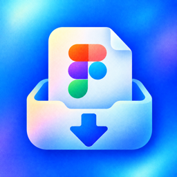
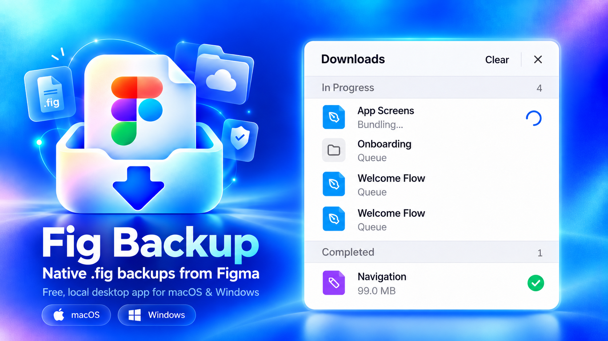
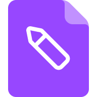
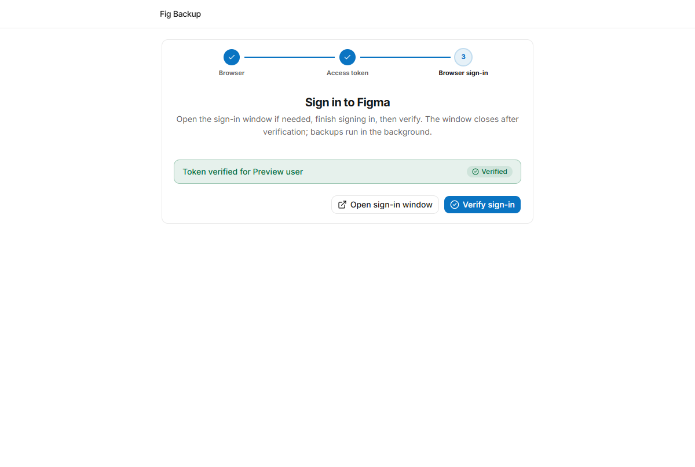
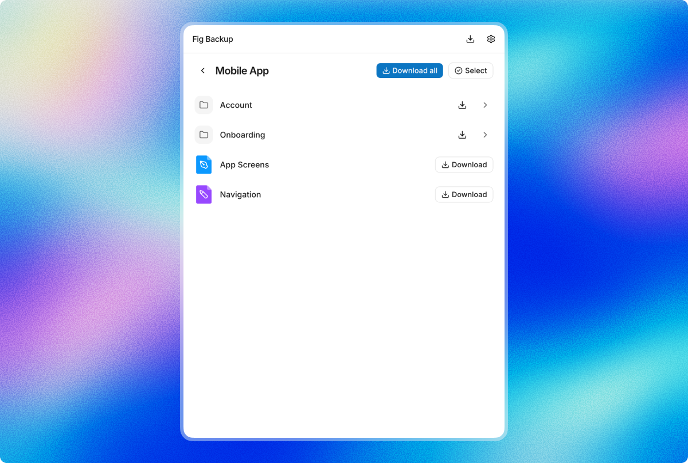
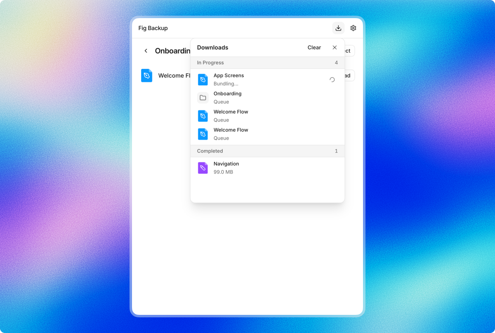
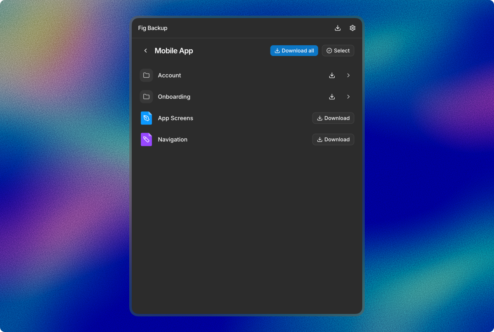

  

<h1 align="center">Fig Backup</h1>

  <a href="../../README.md">English</a> · <b>فارسی</b> · <a href="README.ar.md">العربية</a> · <a href="README.de.md">Deutsch</a> · <a href="README.es.md">Español</a> · <a href="README.fr.md">Français</a> · <a href="README.pt-BR.md">Português</a> · <a href="README.ru.md">Русский</a> · <a href="README.tr.md">Türkçe</a> · <a href="README.zh-CN.md">中文</a> · <a href="README.ja.md">日本語</a>

  
  
  

**نسخه‌های اصلی فایل‌های فیگما را روی رایانهٔ خودتان ذخیره کنید.** Fig Backup یک اپلیکیشن دسکتاپ رایگان برای مک‌های Apple Silicon و Windows 10/11 است. فایل‌های Figma Design را با فرمت `.fig`، فایل‌های FigJam را با فرمت `.jam` و فایل‌های Figma Slides را با فرمت `.deck` ذخیره می‌کند.

  

## دانلود

[**آخرین نسخه**](https://github.com/danialshirali16/Fig-Backup/releases/latest) را دریافت کنید:

| پلتفرم | دانلود |
| --- | --- |
| macOS (Apple Silicon) | [`Fig-Backup-macOS.zip`](https://github.com/danialshirali16/Fig-Backup/releases/latest) — نام فایل شامل شمارهٔ نسخه است |
| Windows 10/11 (x64) | [`Fig-Backup-Windows-x64.zip`](https://github.com/danialshirali16/Fig-Backup/releases/latest/download/Fig-Backup-Windows-x64.zip) — دانلود مستقیم |

هر نسخه به‌همراه فایل `SHA256SUMS.txt` برای بررسی صحت هر دو فایل منتشر می‌شود.

در نخستین اجرا، برنامه برای مرورگر پشتیبان‌گیری، Chromium را دانلود می‌کند (حدود ۱۵۰ مگابایت). نسخهٔ macOS امضای دیجیتال ندارد؛ ممکن است لازم باشد روی برنامه راست‌کلیک کنید و **Open** را انتخاب کنید. برای رفع مشکلات نصب، [راهنمای عیب‌یابی](../TROUBLESHOOTING.md) را ببینید.

## شروع سریع

1. یک Figma Personal Access Token با دسترسی‌های `folders:read` و `file_metadata:read` بسازید (توکن‌های قدیمی با `projects:read` هم کار می‌کنند).
2. Fig Backup را باز کنید، توکن را وارد کنید و در پنجرهٔ مرورگری که برنامه باز می‌کند به فیگما وارد شوید.
3. تیم موردنظر را انتخاب کنید؛ با «دانلود همه» کل تیم را بگیرید یا با «انتخاب» پوشه‌ها و فایل‌های خاص را برگزینید.

ورود به فیگما پیش از اولین پشتیبان‌گیری لازم است؛ می‌توانید این مرحله را در راه‌اندازی اولیه به تعویق بیندازید و برنامه در زمانِ نیاز دوباره از شما می‌پرسد. پس از آن، پشتیبان‌گیری در پس‌زمینه انجام می‌شود.

## چه چیزی پشتیبان‌گیری می‌شود؟

- فایل‌های Figma Design، FigJam و Slides با فرمت اصلی خودشان ذخیره می‌شوند: 
  
  
  
- کل تیم را با یک کلیک پشتیبان بگیرید، یا با «انتخاب» پوشه‌ها و فایل‌های مشخص را برگزینید.
- پشتیبان‌گیری پوشه‌ها، ساختار تیم و پوشه‌ها را حفظ می‌کند.
- «دانلودها» پیشرفت زنده را نشان می‌دهد و می‌توانید موارد صف را دوباره امتحان کنید، متوقف سازید یا لغو کنید. انواع فایل پشتیبانی‌نشده رد می‌شوند و در درصد پیشرفت حساب نمی‌شوند.

پشتیبان‌های تیم و پوشه در `Downloads/Fig Backup/<Team>/<Folder>/…` ذخیره می‌شوند. فایل‌های تکی مستقیماً در `Downloads` می‌روند. اگر نام فایلی تکراری باشد، Fig Backup به‌جای بازنویسی، شماره‌ای به نام اضافه می‌کند.

## چطور کار می‌کند؟

REST API فیگما خروجی اصلی فایل‌ها را ارائه نمی‌دهد. Fig Backup با یک مرورگر، عمل **Save local copy** در ویرایشگر فیگما را خودکار می‌کند؛ در نتیجه فایلی که روی دیسک شما قرار می‌گیرد همان فایلی است که خود ویرایشگر فیگما تولید می‌کند. چون این فرایند به رابط وب فیگما وابسته است، ممکن است تغییر آیندهٔ فیگما نیاز به به‌روزرسانی برنامه داشته باشد.

## تصاویر

| راه‌اندازی اولیه | پوشه‌ها و فایل‌ها |
| --- | --- |
|  |  |
| **«دانلودها»** | **حالت تیره** |
|  |  |

## حریم خصوصی و امنیت

پشتیبان‌ها روی رایانهٔ خودتان ذخیره می‌شوند. Fig Backup برای دسترسی به فایل‌هایتان با فیگما ارتباط می‌گیرد، اما فایل‌ها و توکن شما را به هیچ سروری — از جمله سرور Fig Backup — آپلود نمی‌کند و هیچ اطلاعاتی جمع‌آوری نمی‌کند.

توکن در مسیر `~/Library/Application Support/Fig Backup/token.json` با سطح دسترسی `0600` ذخیره می‌شود. در keychain سیستم ذخیره نمی‌شود و رمزگذاری جداگانه‌ای هم ندارد — از حساب کاربری اشتراکی استفاده نکنید. برای اجرای اسکریپتی، متغیر محیطی `FIGMA_PAT` می‌تواند جایگزین آن شود. جزئیات کامل در [SECURITY.md](../../SECURITY.md). فقط با فایل‌هایی استفاده کنید که برای دسترسی به آن‌ها مجاز هستید.

## راهنما و مشارکت

برای مشکلات نصب، ورود یا دانلود، [راهنمای عیب‌یابی](../TROUBLESHOOTING.md) را بخوانید. گزارش خطا و مشارکت خوش‌آمد است؛ [CONTRIBUTING.md](../../CONTRIBUTING.md) را ببینید.

Fig Backup یک پروژهٔ مستقل است و وابستگی‌ای به Figma ندارد. تحت مجوز [MIT](../../LICENSE) منتشر شده است.

## حمایت مالی

اگر Fig Backup برایتان وقت می‌گیرد، می‌توانید توسعهٔ آن را با بیت‌کوین حمایت کنید:

   
  <code>bc1qf9dufwjyzp7u56lysgn2a0n2956y6xm5dzq6q4</code>

> این فایل ترجمه‌ای است؛ نسخهٔ [انگلیسی](../../README.md) ملاک است.
